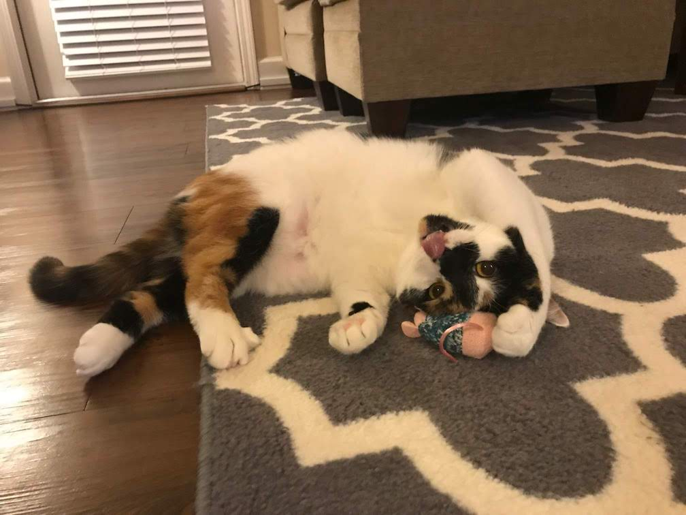

# chessie-choochoo

This project is the frontend for the microservice [ms-metro](https://github.com/andrewevans0102/ms-metro).

This project is named after my cat "Chestnut" (we call her "Chessie" for short).

Here's a picture of her:

The project uses the [WMATA APIs](https://developer.wmata.com/) to retrieve metro information for the Northern Virginia and DC Areas.

To run this project locally just run `npm run start`.

To run unit tests for this project run `npm run test`.

# Future Improvements

- Add more unit test coverage.
- Add E2E tests with [cypress.io](https://www.cypress.io/).
